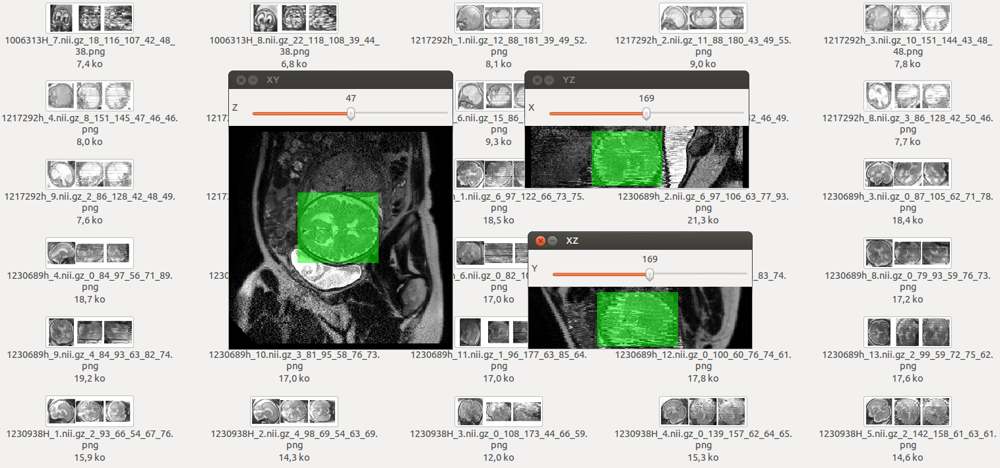

Crop boxes in 3D images
=======================

This script uses SimpleITK to read medical images and OpenCV for the GUI in
order to provide a simple and fast way to crop 3D boxes (for instance to
generate ground truth for a classifier). It is a 3D adaptation of [1].

Usage
-----

ESC or q : exit                    
SPACE : save box                  
ENTER : skip, go to the next file without saving.           

If a cropped box is already found, the file is skipped, so to change a cropped
box, you need to delete the corresponding png.

A regular expression to parse the png files is:

    import re
    pattern =  r'(?P<raw_file>[^/]+\.nii)_(?P<z>\d+)_(?P<y>\d+)_(?P<x>\d+)_(?P<d>\d+)_(?P<h>\d+)_(?P<w>\d+)\.png$'
    match = re.search( pattern, filename )
    m = match.groupdict()
    
See `./run.sh` for an example for cropping,
and `./parse.py ground_truth/ boxes.txt`
for an example for parsing the cropped boxes to a text file.

Screenshot
----------

Reference
---------

[1] N. Seo. Imageclipper - A Tool to Crop Images Manually Fast.
Imageclipper, 2008.
https://code.google.com/p/imageclipper/
